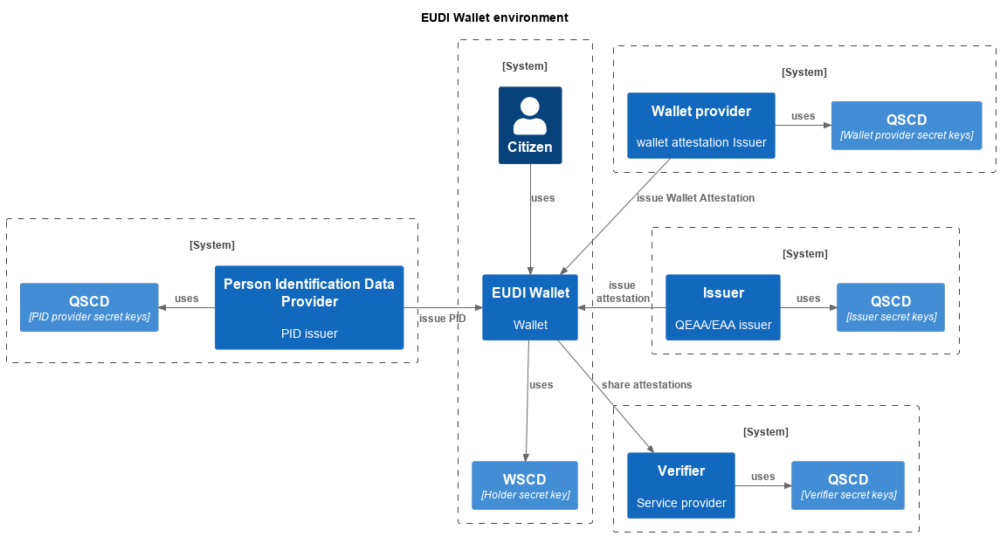
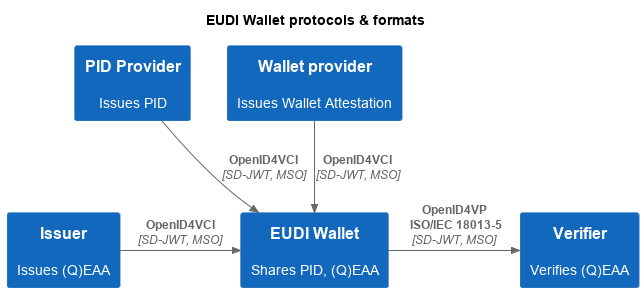
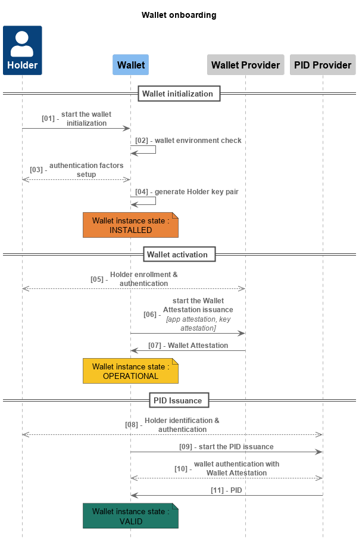
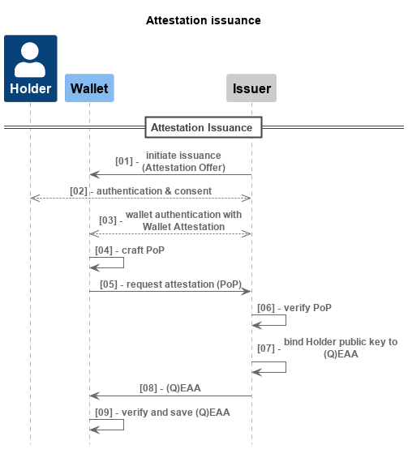
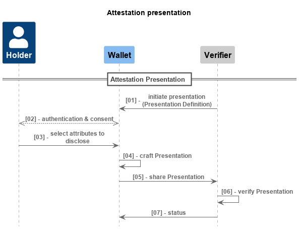

Trust Model: Securing digital identity with advanced cryptographic algorithms
===

**Version:** 1.0

# Glossary
| Term  | Definition  |
|---------|--------------------------------------------------------------------------------------|
| VC      | (verifiable credential) A verifiable credential is a tamper-evident credential that has authorship that can be cryptographically verified |
| VP      | (verifiable presentation) A verifiable presentation expresses data from one or more verifiable credentials, and is packaged in such a way that the authorship of the data is verifiable |
| SE     | (Secure element) is a secure operating system in a tamper-resistant secure component. |
| ZKP    | (zero knowledge proof) is a protocol that enables one party to prove a statement to another party by only revealing that the statement is true and leaking no other information.|
| SSI    | (Self Sovereign identity) is an approach to digital identity that gives individuals control over the information. |
| eIDAS  | (electronic Identification, Authentication and trust Services) |
| Key Attestation | (Key attestation) is used in the process of verifying the authenticity and integrity of a cryptographic key. This process involves providing evidence that a key has been generated and stored in a secure manner, and has not been tampered with or compromised. |
| App Attestation | App attestation is provided by the phone's operating system manufacturer to verify the authenticity of the app|
| BBS#   | A protocol that maintains the anonymity properties of BBS+, including unlinkability and everlasting privacy, without using bilinear pairings, and only requires hardware implementation of established digital signature schemes like ECDSA or EdDSA.|
| LoA-High | level of Assurance High is the highest level of assurance defined by eIDAS. It requires strong authentication methods, such as the use of cryptographic keys or biometric data, to verify the identity of the individual. LOA-High provides a high level of confidence in the authenticity of the user's identity, making it suitable for sensitive transactions and applications that require a high level of security. |
| WSCD     | Wallet Secure Cryptographic Device. https://eu-digital-identity-wallet.github.io/eudi-doc-architecture-and-reference-framework/1.4.0/annexes/annex-1/annex-1-definitions/|
| WUA   | Wallet Unit Attestation : attestation issued by the wallet provider, attesting the properties of the EUDI Wallet Instance. In this document, the WUA is also referred to as the Wallet Attestation.|
| Commitments | Commitments are cryptographic constructs that allow a party to commit to the value of an information or a data to another party in an immutable way without revealing that data to the other party. |

# References
| Doc Number | Ref         | Title        |
|------------|-------------|-------------------------------------------------------------------------------------------------------------------|
| [01] | ARF         | European Digital Identity Wallet Architecture and Reference Framework (ARF). V1.4: https://eu-digital-identity-wallet.github.io/eudi-doc-architecture-and-reference-framework/1.4.0/arf/ |
| [02] | BBS#        | BBS# protocol. https://github.com/user-attachments/files/19198669/The_BBS_Sharp_Protocol.pdf  |
| [03] | EUDI Wallet | The European Digital Identity Wallet. V1.4: https://eu-digital-identity-wallet.github.io/eudi-doc-architecture-and-reference-framework/1.4.0/ |
| [04] | OpenID4VCI | Specification defines an API for the issuance of an attestation. https://openid.github.io/OpenID4VCI/openid-4-verifiable-credential-issuance-wg-draft.html |
| [05] | OpenID4VP | Specification defines a protocol for requesting and presenting an attestation. https://openid.github.io/OpenID4VP/openid-4-verifiable-presentations-wg-draft.html |
| [06] | OpenID4VC HAIP | (High Assurance Interoperability Profile with SD-JWT VC) Specification defines set of requirements for the existing Openid4VC specifications to enable interoperability among Issuers, Wallets and Verifiers of Credentials where a high level of security and privacy is required. https://openid.github.io/oid4vc-haip-sd-jwt-vc/openid4vc-high-assurance-interoperability-profile-sd-jwt-vc-wg-draft.html |
| [07] | ISO/IEC 18013-5 | Describes interface and related requirements to facilitate ISO-compliant driving license functionality on a mobile device |
| [08] | SD-JWT | Specification defines a mechanism for selective disclosure of individual elements of a JSON object. https://www.ietf.org/archive/id/draft-ietf-oauth-selective-disclosure-jwt-12.html |

# Introduction
Under the Electronic Identification, Authentication and Trust Services (eIDAS) 2.0 regulation, 
Member States will provide citizens with digital wallets (EUDI Wallet) to facilitate user identification 
for accessing both public and private digital services throughout the EU.
The EUDI Wallet will ensure a high level of security, rapid accessibility, and compliance with privacy standards, including adherence to GDPR regulations.

As of September 2024, the European Digital Identity Wallet Architecture and Reference Framework (ARF[[01](#references)]) 
has not yet fully realized its objectives concerning security and privacy.

# Objectives of this document
The purpose of this document is to:
- Describe the security and privacy risks that could arise from the implementation of the high-level requirements and specifications of the ARF[[01](#references)].
- Provide solutions, based on the BBS#[[02](#references)] protocol, to mitigate or resolve these risks.
- Provide an implementation of these solutions in the main use cases of the European Digital Identity Wallet (EUDI Wallet [[03](#references)]).

# Structure of this document
This document is organized into three chapters:

- **Privacy on credential presentation**:

  This chapter describes the risks and critical solutions for ensuring the Holder's privacy when sharing Verifiable Credentials (attestations), with a focus on the essential requirements for secure and privacy-friendly digital identity management.

- **Privacy on credential issuance and presentation**: 

  This chapter outlines supplementary risks and solutions essential for ensuring the Holder's privacy during the issuance and presentation of Verifiable Credentials, highlighting the significance of comprehensive privacy measures within the EUDI Wallet framework.

- **Advanced Features**: 
  
  This chapter explores additional mechanisms that can be implemented to strengthen the overall security and privacy of the system, offering advanced features for a more resilient digital identity framework.

## Structure of chapters
All chapters are organized to tackle privacy and security concerns within the context of the ARF[[01](#references)] framework.
The approach is structured as follows:

1. **Risk Identification**: 

    Identify and describe potential privacy and security issues inherent to the ARF[[01](#references)] framework. 
These issues may stem from ambiguities or unaddressed areas within the specifications.

2. **Solution proposal**: 

    Propose mechanisms designed to resolve identified risks. 
These mechanisms are in alignment with current standards and specifications under development, 
ensuring compatibility with the document formats and protocols outlined in the ARF[[01](#references)] framework.

3. **Correlation Table**: 

    Provide a clear overview that correlates a mechanism to the risks they resolve.

4. **Practical Implementation**: 

    Describe a practical implementation of these mechanisms through key use cases such as attestation issuance and presentation.

>By systematically addressing privacy and security concerns and providing practical solutions, 
>these documents aim to strengthen the robustness and reliability of the ARF[[01](#references)] framework.

# Context

## Actors and Roles
These documents outline the roles and actors defined within the ARF. 
In the context of the EUDI Wallet, the following actors are identified:

- **Holder**: The citizen.

- **EUDI Wallet**: The wallet provided to the citizen, enabling interaction with other actors to request and share attestations.

  This wallet, provided by a **Wallet Provider**, relies on a Wallet Secure Cryptographic Device (WSCD[[01](#glossary)]) to protect the **Holder's** private key.
It is assumed that the **Holder** owns a unique key pair used for all transactions, bound to the **PID**[[01](#glossary)] and the ***Wallet Attestation***,
establishing a strong link between the individual and the digital identity.

- **Wallet Provider**: The entity responsible for provisioning and operating an EUDI Wallet Solution.

  The **Wallet Provider** also issues an attestation called ***Wallet Attestation***, 
attesting the properties of the EUDI Wallet Instance[[01](#glossary)], and the device security environment.
When issuing the ***Wallet Attestation***, the **Wallet Provider** acts as an **Issuer**.

- **Issuer**: The entity issuing attestations to the **Holder**.

  Two types of attestations can be issued: Electronic Attribute Attestation (EAA[[01](#glossary)]) issued by **Issuers** 
and Qualified Electronic Attribute Attestation (QEAA[[01](#glossary)]) issued by qualified **Issuers**.
These documents concentrate on QEAA exchanges due to the heightened constraints associated with this type of attestation. 
Notably, the privacy and security issues addressed for QEAA are also applicable to EAA.
Like other actors, The **Issuer** possesses a digital identity represented by one or more key pairs.
It is advisable for the **Issuer** to maintain multiple key pairs, ensuring that the rotation frequency is managed in a manner that does not compromise the privacy of citizens.

- **Person Identification Data Provider**: A Member State or other legal entity providing **Person Identification Data (PID[[01](#glossary)])** to the **Holder**.

  The **PID** issuance process guarantees that all required verifications have been performed to establish a binding 
between the Holder as an individual and their digital identity, which is represented by their key pair referenced within the PID attestation.

- **Verifier**: The Relying Party (RP[[01](#glossary)]) with whom the **Holder** shares one or more attestations.

Like other actors, the Verifier has a digital identity, represented by one or more key pairs.

The following diagram presents the relationships and exchanges between the actors presented:

Figure 1: Actors

## EUDI Wallet high level flows
The primary interactions between the EUDI Wallet and other system actors involve the retrieval of attestations from Issuers and the sharing of attestations with Verifiers. 
These documents considers the protocols and formats recommended in the ARF for attestation exchanges, ensuring compatibility with the proposed mechanisms.

### Protocols and Formats
- **Attestation issuance**:
  - **Remote flow protocol**: OpenID4VCI[[04](#references)]

- **Attestation Presentation**:
  - **Remote flow protocol**: OpenID4VP[[05](#references)]
  - **Proximity flow protocol**: ISO/IEC 18013-5:2021[[07](#references)]

- **Attestation Formats**:
  - **Selective Disclosure for JWTs (SD-JWT)[[08](#references)]**
  - **Mobile Security Object (ISO/IEC 18013-5)[[07](#references)]**

The diagram below illustrates the formats and protocols usage among the actors within the ecosystem:

Figure 2: Protocols and formats

By adhering to these protocols and formats, 
the EUDI Wallet ensures secure and compatible interactions with issuers and verifiers.

>Note: In these documents, we focus solely on the SD-JWT[[08](#references)] and ISO/IEC 18013-5[[07](#references)] formats, excluding other formats such as the W3C Verifiable Credentials Data Model v1.1

### Onboarding Process
The onboarding phase is a prerequisite for the issuance and sharing of (Q)EAAs. 
This phase is critical as it establishes a robust relationship between the individual and their digital identity.

The diagram below illustrates the steps involved in the onboarding process:

Figure 3: Onboarding Process

The onboarding process is divided into three phases:

**1. Wallet Initialization** - During this step, the following actions are performed:
- **Security Checks**: The Wallet performs security verifications on the mobile application, operating system, and any other relevant subsystem.
The Wallet retrieves an ***app attestation*** provided by the device operating system, attesting the genuineness of the Wallet application.
- **Authentication Factors Initialization**: Authentication factors are initialized to ensure that the Holder has the sole control of its private key.
- **Key Pair Generation**: Wallet generates the Holder's key pair and retrieves a ***key attestation***.

**2. Wallet Activation** - During this step, the Wallet performs various verifications to ensure a high level of security within the wallet environment:
- **Security Checks**: The Wallet sends the ***app attestation*** and the ***key attestation*** to the Wallet Provider.
- **Wallet Attestation Issuance**: At the end of the process, the Wallet Provider issues a ***Wallet Attestation***.
This attestation attests of the wallet environment and that the wallet meets all technical prerequisites for the PID issuance.

**3. PID Issuance** - During this step, the PID provider performs two main actions:
- **Identification and Authentication of the Holder**: This process is defined by the Member States and must comply with legal 
requirements such as LoA High, GDPR, and any other domestic or union law.
- **Wallet Authentication**: This process can be performed using the **Wallet Attestation** to validate the EUDI Wallet instance
environment by verifying the non-revocation of the wallet instance and the security elements referenced.

Once the onboarding process is complete, the wallet is ready to retrieve and share attestations. 

### Attestation Issuance Process 
The attestation issuance process involves both the Holder and an Issuer. 
Upon completion of this process, the Issuer provides an attestation to the Holder, which can be presented in future interactions.

The diagram below illustrates the functional steps involved in the Attestation Issuance process:

Figure 4: Attestation Issuance Process - Functional flow

**Flow description**
- [01]: The Issuer initiates an Issuance process. The Wallet receives an ***Attestation Offer***
- [02]: The Holder authenticates to the Issuer 
- [03]: The Wallet authenticates to the Issuer by sharing a ***Wallet Attestation*** presentation
- [04]: The Wallet crafts the Proof Of Possession of their private key (PoP) and the Holder signs the PoP
- [05]: The Wallet requests for the attestation by sharing the PoP
- [06]: The Issuer verifies the PoP sent by the Holder
- [07]: The Issuer crafts the attestation, binds the Holder key to the attestation and signs the attestation
- [08]: The Issuers issues the attestation
- [09]: The Wallet verifies the attestation and saves the attestation

### Attestation presentation process
The attestation presentation process involves both the Holder and a Verifier.
Upon completion of this process, The Holder shares one or more attestation to the Verifier.

The diagram below illustrates the functional steps involved in the Attestation Presentation process.

Figure 5: Attestation Presentation Process - Functional flow

**Flow description**
- [01]: The Verifier initiates a presentation process. The Wallet receives a ***Presentation Definition***
- [02]: The Wallet also authenticates the holder and gathers consent to present the requested attestation.
- [03]: The Holder selects the attestations and the claims to share with the Verifier
- [04]: The Wallet crafts the presentation and signs the presentation
- [05]: The Wallet sends the presentation to the Verifier
- [06]: The Verifier verifies the presentation
- [07]: The Verifier grants access to the Holder to the service
