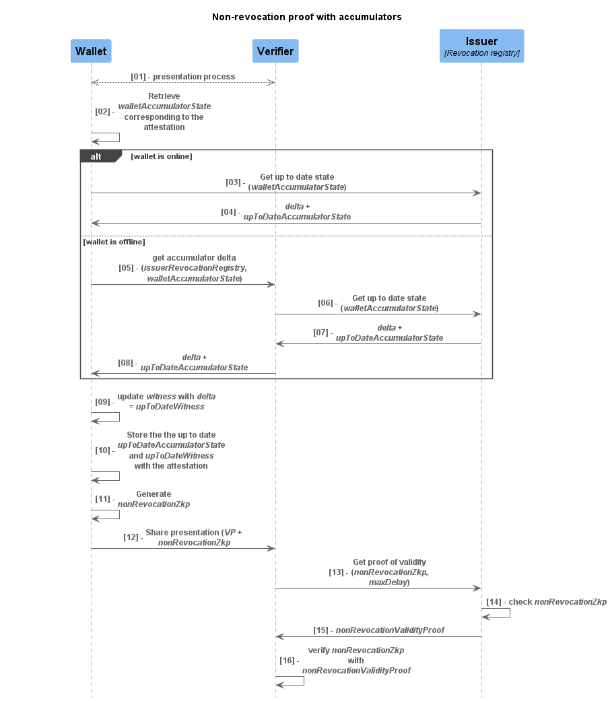
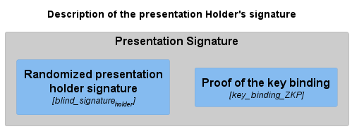

Trust Model: Privacy on attestations presentation
===

**Version:** 1.0

# Chapter context
This chapter focuses on the requirements essential for the Verifiable Credentials (attestations) presentation process, outlining the associated risks and the mechanisms implemented to eliminate or mitigate these challenges.
In addition to the mechanisms for the presentation process, supplementary mechanisms must be developed for the Verifiable Credentials issuance process to safeguard citizens' full privacy and enhance the security of the framework. 
These additional mechanisms will be discussed in subsequent chapters.

# Table of Contents
- [1. Privacy and security challenges](#1-privacy-and-security-challenges)
  - [1.1. WSCDs and Wallet binding](#11-wscds-and-wallet-binding)
    - [1.1.1. Implied revocation in case of WSCD compromise](#111-implied-revocation-in-case-of-wscd-compromise)
    - [1.1.2. Implied revocation in case of loss, theft of the Wallet](#112-implied-revocation-in-case-of-loss-theft-of-the-wallet)
  - [1.2. Attestation issuance](#12-attestation-issuance)
    - [1.2.1. Attestation identifier managed by the Issuer](#121-attestation-identifier-managed-by-the-issuer)
  - [1.3. Attestation presentation](#13-attestation-presentation)
    - [1.3.1. Holder tracking via Holder's public elements and signatures by Verifiers](#131-holder-tracking-via-holders-public-elements-and-signatures-by-verifiers)
    - [1.3.2. Holder tracking via Holder's public elements and signatures in case of Verifier and Issuer collusion](#132-holder-tracking-via-holders-public-elements-and-signatures-in-case-of-verifier-and-issuer-collusion)
    - [1.3.3. Holder tracking via digest values](#133-holder-tracking-via-digest-values)
    - [1.3.4. Holder tracking via salts used to calculate the digest](#134-holder-tracking-via-salts-used-to-calculate-the-digest)
    - [1.3.5. Everlasting privacy](#135-everlasting-privacy)
  - [1.4. Attestation revocation](#14-attestation-revocation)
    - [1.4.1 Holder tracking in case of collusion between Verifier and Issuer](#141-holder-tracking-in-case-of-collusion-between-verifier-and-issuer)
    - [1.4.2 Privacy preservation during revocation check on Issuer](#142-privacy-preservation-during-revocation-check-on-issuer)
- [2. Security and privacy mechanisms](#2-security-and-privacy-mechanisms)
  - [2.1 Static undisclosed digest](#21-static-undisclosed-digest)
    - [2.1.1 Holder tracking via attributes](#211-holder-tracking-via-attributes)
  - [2.2 Digest calculation without salt](#22-digest-calculation-without-salt)
  - [2.3 Attestation identifier computation](#23-attestation-identifier-computation)
  - [2.4 Holder Public key and Issuer signature randomization during the presentation process](#24-holder-public-key-and-issuer-signature-randomization-during-the-presentation-process)
    - [2.4.1 Holder Public key randomization during the presentation process](#241-holder-public-key-randomization-during-the-presentation-process)
    - [2.4.2 Issuer signature randomization during the presentation process](#242-issuer-signature-randomization-during-the-presentation-process)
    - [2.4.3 End to End high level flow](#243-end-to-end-high-level-flow)
  - [2.5 Proofs with accumulators](#25-proofs-with-accumulators)
    - [2.5.1 Non-expiration proof with accumulators](#251-non-expiration-proof-with-accumulators)
    - [2.5.2 Non-revocation proof with accumulators](#252-non-revocation-proof-with-accumulators)
  - [2.6 Wallet instance identifier and WSCD references in attestations](#26-wallet-instance-identifier-and-wscd-references-in-attestations)
    - [Protection against Wallet loss or theft.](#protection-against-wallet-loss-or-theft)
    - [Protection against WSCD breach](#protection-against-wscd-breach)
    - [2.6.1 Wallet-identifier and WSCD-reference in attestations during issuance process](#261-wallet-identifier-and-wscd-reference-in-attestations-during-issuance-process)
    - [2.6.2 Wallet-identifier and WSCD-reference in attestations during presentation process](#262-wallet-identifier-and-wscd-reference-in-attestations-during-presentation-process)
- [3. Coverage of security and privacy challenges by the mechanisms](#3-coverage-of-security-and-privacy-challenges-by-the-mechanisms)
- [4. BBS# implementation in SSI flows](#4-bbs-implementation-in-ssi-flows)
  - [4.1 Validation of transaction when not using pairing](#41-validation-of-transaction-when-not-using-pairing)
    - [4.1.1 Holder requests a signature validity proofs on each presentation](#411-holder-requests-a-signature-validity-proofs-on-each-presentation)
    - [4.1.2 Verifier obtain the signature validity proofs from the Issuer](#412-verifier-obtain-the-signature-validity-proofs-from-the-issuer)
    - [4.1.3 Holder stores batches of signature validity proofs](#413-holder-stores-batches-of-signature-validity-proofs)
    - [4.1.4 DDoS protection of Issuer's proof-of-validity APIs](#414-ddos-protection-of-issuers-proof-of-validity-apis)
  - [4.2 Attestation issuance flow](#42-attestation-issuance-flow)
  - [4.3 Attestation presentation flow](#43-attestation-presentation-flow)
  - [4.4 Description of proofs during presentation](#44-description-of-proofs-during-presentation)
    - [4.4.1 Description of the attestation signature](#441-description-of-the-attestation-signature)
    - [4.4.1 Description of the presentation signature](#441-description-of-the-presentation-signature)


# 1. Privacy and security challenges
In the context of the European Digital Identity Wallet, privacy and security are paramount concerns that must be addressed to ensure user trust and compliance with regulatory frameworks such as GDPR. This section aims to provide a comprehensive overview of the privacy and security risks, setting the stage for subsequent discussions on proposed mechanisms to mitigate these challenges effectively.


## 1.1. WSCDs and Wallet binding

### 1.1.1. Implied revocation in case of WSCD compromise
In the event of a WSCD compromise, all attestations issued and bound to a Holder public key managed by the WSCD must be invalidated. 
The process of revoking these attestations necessitates notifying all Issuers, who must then implement the attestation revocation based on the WSCD identifier. 
This workflow involves multiple actors and requires validation of the Issuer's implementation. 

Therefore, this approach is not considered robust.

### 1.1.2. Implied revocation in case of loss, theft of the Wallet
In this case, the Wallet instance is compromised. 
In the event of a Wallet instance compromise, all attestations issued and bound to a Holder public key managed by the Wallet instance must be invalidated.
The process of revoking these attestations necessitates notifying all Issuers, who must then implement the attestation revocation based on the Wallet instance identifier.
This workflow involves multiple actors and requires validation of the Issuer's implementation.

Therefore, this approach is not considered robust.


## 1.2. Attestation issuance

### 1.2.1. Attestation identifier managed by the Issuer
The attestation identifier is required to manage the attestation revocation.
If the Issuer is the only entity to forge the attestation identifier, a malicious Issuer could forge an identifier that allows the tracking of the Holder (Holder is part of a group, for instance).

Additionally, this could impact applications such as petitions/polls/online-voting, as it could prevent certain people from voting or signing petitions: a malicious Issuer could add the attestation identifier to a black list, for instance.


## 1.3. Attestation presentation

### 1.3.1. Holder tracking via Holder's public elements and signatures by Verifiers
During the presentation process, the Wallet transmits traceable attestation elements to the Verifier, such as:
- Holder public key
- Issuer signature
- WSCD, Wallet instance identifiers

These elements are sealed by the Issuer's signature and therefore do not vary between different presentations. 
Based on these elements, a Verifier or colluding malicious Verifiers can track the Holder.

For example, 
a Verifier can track the attestation's digital signature to detect multiple presentations by the same Holder,
even though the attributes of the presentation do not disclose any identifying claims about the Holder.

### 1.3.2. Holder tracking via Holder's public elements and signatures in case of Verifier and Issuer collusion
During the issuance and presentation process, some common elements are known by both the Issuer and Verifier, such as:
- Holder public key
- Issuer signature (produced by the Issuer)
- WSCD, Wallet instance identifiers

Shared elements between Issuers and Verifiers create a vulnerability: colluding malicious entities (Issuers and Verifiers) 
can exploit this commonality to track Holders across the system.

For example,  
a Verifier, upon receiving an anonymized attestation, 
can potentially deanonymize the Holder by leveraging the attestation's signature to query the Issuer for the Holder's identity.

### 1.3.3. Holder tracking via digest values
In the context of selective disclosure, claims are encoded with a digest in SD-JWT and MSO formats. 
During the presentation process, even if a claim is not disclosed, the digest is included in the attestation, 
allowing Verifiers to track the Holder based on the digest value, which does not vary across multiple presentations.
This allows the Verifier to conclude that both presentations originate from the same Holder and can combine these pieces of information to extend the Holder's profile with each later presentation.

Therefore, the use of digests poses significant privacy risks:
- **Tracking by malicious Verifier:** A malicious Verifier can track the Holder across different presentations by correlating the digests.
- **Malicious Colluded Verifiers:** Multiple Verifiers working together can share and correlate digests to track the Holder.
- **Malicious Colluded Issuer-Verifier:** An Issuer and Verifier working together can share and correlate digests to track the Holder.

### 1.3.4. Holder tracking via salts used to calculate the digest
In the context of selective disclosure, salts are used to encode plaintext claims into digests. 
Each claim must be salted independently with a unique salt. 
However, during the presentation process, a Verifier can track the salts of disclosed claims to profile and track the Holder.

For example, if a Holder presents the same attestation to the Verifier twice, with the same disclosure, the salt will be identical, allowing the Verifier to use this information to track the Holder.

Another example with Verifier collusion:
- **First Presentation on verifierA requested a proof of age:** The Holder uses their identity attestation and only discloses their age of a majority.
- **Second Presentation on verifierB requested the user identity:** The Holder uses their identity attestation and discloses all attestation claims.

The Verifiers can track the Holder by identifying the salt associated with the age of a majority in both presentations. 
This allows both Verifiers to conclude that both presentations originate from the same Holder and to combine their information about the Holder activity.

The use of salts to compute the digest, poses significant privacy risks:
- **Tracking by malicious Verifier:** A malicious Verifier can track the Holder across different presentations by correlating the salts.
- **Malicious colluded Verifiers:** Multiple Verifiers working together can share and correlate salts to track the Holder.
- **Malicious colluded Issuer-Verifier:** An Issuer and Verifier working together can share and correlate salts to track the Holder.

### 1.3.5. Everlasting privacy
With the advent of quantum computing, attackers will potentially be able to break most of the current asymmetric cryptographic standards. 
This introduces the risk of "steal now, decrypt later" (retrospective decryption). 
Data intercepted and stored today could be decrypted in the future when quantum computing becomes more advanced, exposing the Holder's privacy.
Sensitive use cases like petitions, polls, and online voting are particularly vulnerable, as the Holder's identity could be revealed long after the data was initially captured.


## 1.4. Attestation revocation
Several solutions are proposed to provide the Verifier with proof of non-revocation of an attestation, such as certificate revocation lists or proof based on tokens issued by the Issuer. 
However, all these solutions involve one of the following risks:

### 1.4.1 Holder tracking in case of collusion between Verifier and Issuer
In solutions where the Issuer interacts during verification, a potential security vulnerability arises if the Issuer colludes with the Verifier. 
This collusion enables timing correlation attacks, allowing the tracing of a Holder's activities based on transaction timestamps. 

A potential privacy vulnerability exists when the Holder fetches a non-revocation proof from the Issuer prior to Verifier presentation. 
If the Issuer and Verifier collude, they can correlate their respective timestamps and metadata to deanonymize the Holder. 

### 1.4.2 Privacy preservation during revocation check on Issuer
In scenarios where the Verifier must validate attestation status with the Issuer, it enables the Issuer to collect information about the attestation presentation. 
This includes attestation type, Holder identity, Verifier identity, and timestamp of the verification request...

For example, 
when a Verifier queries an Issuer's revocation registry to check an attestation's status, 
The Issuer can infer the Holder's attestation usage from these queries. 


# 2. Security and privacy mechanisms
This section outlines implementable mechanisms to mitigate the aforementioned privacy and security challenges.
These solutions are derived in part from the BBS#<sup>[[02](./Trust-model-Introduction.md#references)]</sup>.

## 2.1 Static undisclosed digest
This mechanism is designed to mitigate the risk of Holder tracking through the use of digest values by substituting the original digest value. This approach not only enhances user privacy but also ensures interoperability with existing standards.

The mechanism implements a local Wallet process during the anonymization step of attestation presentation to replace the potentially trackable digest with a commitment to the digest. Since the digest cannot be replaced by a commitment without impacting the attestation format (for instance, 256 characters in the SD-JWT format), the digest is replaced with a static value, and the commitment is included with the attestation Issuer's signature. This static value should be defined by convention, for example, as "0000000000000000000000000000000000000000000," to ensure compatibility with attestation format standards. A global static value helps mitigate risks associated with timing attacks if the Holder must contact a third party to retrieve it.

The process maintains attestation integrity through the following steps (This process is carried out at each presentation):
- **Digest Commitment**: The Wallet computes a cryptographic commitment of the original digest.
- **Zero-Knowledge Proof (ZKP) Generation**: The Wallet generates a ZKP to demonstrate that the Issuer's signature is valid for all the attestation data, including the undisclosed data replaced by commitments.
- **Signature Augmentation**: The commitment and the ZKP are added to the Issuer's signature.

This mechanism aims to prevent the risk of [Holder tracking via digest values](#133-holder-tracking-via-digest-values) by substituting the digest value. 
In addition, this solution aligns with the mechanisms for selective disclosure as defined in the ISO mDL and SD-JWT formats, 
ensuring that it can be integrated into existing systems without disruption.
This approach enhances privacy while maintaining interoperability with existing standards.

Below is a non-normative example of a SD-JWT attestation, presented to a Verifier with two undisclosed values:
```
- Payload:
{
  "_sd": [
    "mqXw1Euo3ut4y7cVBrTNbFuhv8O0VSXahlD5twVdLD8",
    "0000000000000000000000000000000000000000000",
    "0000000000000000000000000000000000000000000"
  ],
  "iss": "https://example.com/issuer",
  "iat": 1683000000,
  "exp": 1883000000,
  "type": "https://credentials.example.com/VC_example",
  "_sd_alg": "sha-256",
  "cnf": {
    "jwk": {...}
  }
}
- Signature:
<issuerSignature>+<CommitmentOfUndisclosedClaims>+<ZkpForUndisclosedClaims>
- Disclosure:
WyJGR2YwQ09LQnFsenU5SlF0cDhiRGFBPT0iLCJsYXN0TmFtZSIsIkRvZSJd
```

In addition, this mechanism preserves [everlasting privacy](#135-everlasting-privacy) through the use of commitments (Pedersen commitment scheme), 
embedding undisclosed values while using static values for format compatibility. 
This approach guarantees that undisclosed attributes remain confidential, 
safeguarding them against future threats, including potential quantum-computing attacks.


### 2.1.1 Holder tracking via attributes

Similarly, it is possible to track the user through attestation attributes, such as the issuance date, expiration date, and attestation identifier. 
The mechanism described above can be extended to mitigate Holder tracking through these attributes.

Indeed, the wallet may replace the value of the attribute with the commitment of the value 
and compute a Zero-Knowledge Proof (ZKP added to the Issuer's Signature) to maintain the integrity of the attestation. 

Below is a non-normative example of a SD-JWT attestation, presented to a Verifier with one undisclosed attribute value (e.g., the attestation identifier):
```
- Payload:
{
  "_sd": [
    "mqXw1Euo3ut4y7cVBrTNbFuhv8O0VSXahlD5twVdLD8",
  ],
  "id": "<CommitmentOfUndisclosedIdAttribute>",
  "iss": "https://example.com/issuer",
  "iat": 1683000000,
  "exp": 1883000000,
  "type": "https://credentials.example.com/VC_example",
  "_sd_alg": "sha-256",
  "cnf": {
    "jwk": {...}
  }
}
- Signature:
<issuerSignature>+<ZkpForUndisclosedIdAttribute>
- Disclosure:
WyJGR2YwQ09LQnFsenU5SlF0cDhiRGFBPT0iLCJsYXN0TmFtZSIsIkRvZSJd
```

**Impact on standard:**

Although the solution is elegant, 
imposing a commitment as an attribute value could have an unpredictable impact during verification. 
For example, some market Verifiers might not accept a commitment in place of a straightforward attribute value, such as a date.

For compatibility reasons, we propose to generalize the solution used by Digest to attributes 
by replacing the value of the attribute with a static value that has a meaning depending on the specific attribute.

The process maintains attestation integrity through the following steps (This process is carried out at each presentation):
- **Attribute Commitment**: The Wallet computes a cryptographic commitment of the original attribute value.
- **Zero-Knowledge Proof (ZKP) Generation**: The Wallet generates a ZKP to demonstrate that the Issuer's signature is valid for all the attestation data, including the undisclosed data replaced by commitments.
- **Signature Augmentation**: The commitment and the ZKP are added to the Issuer's signature.

Below is a non-normative example of a SD-JWT attestation, presented to a Verifier with three undisclosed attributes values 
(e.g., the attestation identifier, issuance date and expiry date):
```
- Payload:
{
  "_sd": [
    "mqXw1Euo3ut4y7cVBrTNbFuhv8O0VSXahlD5twVdLD8",
  ],
  "id": "<Static-value>",
  "iss": "https://example.com/issuer",
  "iat": 0,  // January 1, 1970
  "exp": 0,  // January 1, 1970
  "type": "https://credentials.example.com/VC_example",
  "_sd_alg": "sha-256",
  "cnf": {
    "jwk": {...}
  }
}
- Signature:
<issuerSignature>+<CommitmentOfUndisclosedIdAttibute>+<ZkpForUndisclosedIdAttibute>+<CommitmentOfUndisclosedIatAttibute>+
<ZkpForUndisclosedExpAttibute>+<CommitmentOfUndisclosedExpAttibute>+<ZkpForUndisclosedIdAttibute>
- Disclosure:
WyJGR2YwQ09LQnFsenU5SlF0cDhiRGFBPT0iLCJsYXN0TmFtZSIsIkRvZSJd
```

## 2.2 Digest calculation without salt
The goal of this directive is to remove the salt for the digest computation, which can be used as a means to track the Holder [via salts used to calculate the digest](#134-holder-tracking-via-salts-used-to-calculate-the-digest).

The randomness in the digest computation ensures that the same plaintext claim value does not produce the same digest value. It also makes it infeasible to guess the preimage of the digest (and thereby learn the plaintext claim value) by enumerating potential values for a claim in the hash function to search for a matching digest value.

Therefore, to ensure Holder's privacy, the digests of undisclosed claims shall not be revealed during the presentation process (cf. section [Static undisclosed digest](#21-static-undisclosed-digest)). Thus, there is no security requirement to add salt in the digest computation.

> **Note** : This directive requires making salt optional for the calculation of the digest in the specifications of the attestation formats discussed in this document.


## 2.3 Attestation identifier computation
The attestation identifier is required for the attestation non-revocation proof process (cf. section [non revocation proof with accumulators](#252-non-revocation-proof-with-accumulators)).
To address the risk described in section [attestation identifier managed by the Issuer](#121-attestation-identifier-managed-by-the-issuer), we propose defining a convention for computing the attestation identifier:
- The attestation identifier must be generated by applying a one-way function to the Holder's public key and a random value provided by the Wallet<sup>*</sup>.

This solution has several advantages:
- **Guaranteed uniqueness**: Since the Holder's public key must be unique for each transaction to ensure privacy, the identifier based on it will also be unique.
- **No additional exchanges required**: It does not require additional exchanges between the Holder and the Issuer.
- **Verification of compliance**: The Holder can verify at the end of the issuance process that the Issuer has adhered to the convention.
- **Confidentiality**: The identifier is known only to the Issuer and the Holder, ensuring no one else has access to it.

(*): The random value provided by the Wallet is required to ensure the uniqueness of the attestation identifier. 
However, in the next section, which assesses full privacy with during the issuance process, 
the necessity of this random value shall be reconsidered, maintaining the uniqueness of issued credentials identifier.


## 2.4 Holder Public key and Issuer signature randomization during the presentation process
The goal of these mechanisms is to prevent Holder tracking based on their public key and signatures.
The randomization of the Holder's public key and Issuer's signature mitigates the risk of:
- [Holder tracking via Holder's public elements and signatures by Verifiers](#131-holder-tracking-via-holders-public-elements-and-signatures-by-verifiers) during the attestation presentation process.
- [Holder tracking via Holder's public elements and signatures in case of Verifier and Issuer collusion](#132-holder-tracking-via-holders-public-elements-and-signatures-in-case-of-verifier-and-issuer-collusion) during the attestation presentation process.

### 2.4.1 Holder Public key randomization during the presentation process

Most WSCDs support common digital signature algorithms, such as ECDSA.
However, developers are restricted from implementing new cryptographic functionalities for security reasons.
This limitation makes it challenging to use these WSCDs for purposes beyond their original design, such as generating blinded public keys (blind_pk<sub>Holder</sub>). 
Consequently, a WSCD cannot perform operations like "blinding" its own public key,
nor can a WSCD generate the signature (blind_signature<sub>Holder</sub>) associated with blind_pk<sub>Holder</sub>.

**Randomization Process**
The following outlines how a WSCD and the associated Wallet application can collaboratively anonymize the public key (blind_pk<sub>Holder</sub>) 
and compute the anonymized signature (blind_signature<sub>Holder</sub>).
We propose two variants of BBS#: in the first one, we assume that the digital signature algorithm supported by the WSCD is EC-SDSA (ECSchnorr),
while in the second one, we assume it is ECDSA.

**Variant 1: EC-SDSA (Elliptic Curve Schnorr Digital Signature Algorithm)**

In this variant, we assume that the digital signature algorithm supported by the WSCD is EC-SDSA. 
The Wallet application can leverage the capabilities of EC-SDSA to facilitate the randomization process and generate the corresponding randomization signature.

Joint computation of blind_pk<sub>Holder</sub> and blind_signature<sub>Holder</sub> with EC-SDSA (ECSchnorr):


**Variant 2: ECDSA (Elliptic Curve Digital Signature Algorithm)**

Below, we explain how the WSCD and the associated Wallet application can jointly randomization the public key blind_pk<sub>Holder</sub> 
and calculate the anonymized blind_signature<sub>Holder</sub>.

Joint computation of blind_pk<sub>Holder</sub> and blind_signature<sub>Holder</sub> with EC-SDSA (ECSchnorr):


> **Note** : In the remainder of this document, 
> the discussion and examples will be presented using EC-SDSA as the signature algorithm. 
> However, as previously indicated, the reasoning and principles outlined can also be applied to ECDSA.**


### 2.4.2 Issuer signature randomization during the presentation process
Using the properties of BBS+, 
the Wallet can randomize the BBS+ signature of the Verifiable Credential issued by the Issuer. 
This process enables the computation of the blinded Issuer signature (blind_signature<sub>Issuer</sub>), 
effectively preventing both the Issuer and the Verifier 
from tracking the Holder through the Issuer's signature footprint.

### 2.4.3 End to End high level flow

The following sequence outlines the process of anonymizing the Holder's public key, 
Holder's signature, and Issuer's signature during the presentation of an attestation. 
For the sake of simplicity, we will focus on the presentation of a single attestation.

Assumptions:
* Each Holder manages a unique EC-SDSA key pair, which is used for cryptographic binding to the Holder.
* The private key associated with this key pair is generated and exclusively controlled by the Holder's WSCD.


**Flow description**
- [01]: This step represents the initial step of the presentation process, which are not detailed in this context.
- [02]: The Wallet generates a new random value (**r<sub>holder</sub>**) locally. This random is used exclusively for the Presentation transaction, meaning it does not need to be stored or generated thanks to the capabilities of a WCSD.
- [03]: At this step, we have generated a new Holder public key (**pk_blind<sub>holder</sub>**) that is designed to be unrecognizable by the credential Issuer, as well as by any other Issuers and Verifiers with whom the Holder has previously interacted.
- [04-05]: The Wallet generates a new random value (**r<sub>issuer</sub>**) to refresh the Issuer's signature. This random is used exclusively for the Presentation transaction, meaning it does not need to be stored or generated thanks to the capabilities of a WCSD. At this step, we have a refreshed attestation bound to **pk_blind<sub>holder</sub>**, signed with **signature_blind<sub>issuer</sub>**. 
- [06]: The Wallet generates a zero-knowledge proof (ZKP) called **attestation_integrity_ZKP** to prove the integrity of the refreshed attestation to the Issuer. The functional description of this proof is as follows: 
  - The Holder knows a public key (**pk<sub>holder</sub>**) and a random value (**r<sub>holder</sub>**) such that applying **r<sub>holder</sub>** to **pk<sub>holder</sub>** results in **pk_blind<sub>holder</sub>**
  - The Holder knows a signature (**signature<sub>issuer</sub>**) and a random value (**r<sub>issuer</sub>**) such that applying **r<sub>issuer</sub>** to **signature<sub>issuer</sub>** results in **signature_blind<sub>issuer</sub>**
  - The blinded Issuer signature **signature_blind<sub>issuer</sub>** relates to the attestation data, which includes the blinded Holder public key **pk_blind<sub>holder</sub>**
- [08-10]: The Wallet crafts the presentation for the Verifier and signs it using their WSCD. The **signature<sub>holder</sub>** is an ECSDSA signature on the **Presentation** that can be verified with **pk<sub>holder</sub>**.
- [11]: The Wallet anonymizes the signature to get a signature that can be verified with the blinded Holder's public key, previously generated. The **signature_blind<sub>holder</sub>** is an ECSDSA signature on the **Presentation** that can be verified with **pk_blind<sub>holder</sub>**.
- [12]: The Wallet generates a zero-knowledge proof (ZKP) called **key_binding_ZKP** to prove that the Holder knows a  **sk_blind<sub>holder</sub>** associated to **pk_blind<sub>holder</sub>**.
- [13]: The Wallet sends the presentation to the Verifier, who can verify it.

This flow is executed for each presentation,
allowing the Holder to share a new public key value and a refreshed attestation for every transaction.
Consequently, the Holder public key and the Holder signature presented to the Verifier will consistently vary.


## 2.5 Proofs with accumulators
This section outlines how the accumulators facilitate the proof to the Verifier that the presented attestation has not been revoked,
while canceling the risk of [Holder tracking during the revocation process in scenarios where there may be collusion between the Verifier and Issuer](#141-linkability-in-case-of-collusion-between-verifier-and-issuer), 
as well as the risk of [Holder usage deduction by the Issuer during the Verifier's revocation check](#142-privacy-preservation-during-revocation-check-on-issuer).

An accumulator is a fixed-size structure (usually 256 bits) that allows adding or removing values and proving via Zero-Knowledge Proof (ZKP) whether a specific value is included or not, with the capacity to hold billions of values. 

To build this type of Zero-Knowledge Proof (ZKP), two elements are required:
- **The Witness**: Provided by the Issuer during the attestation issuance process. The witness must be updated in sync with the accumulator value whenever a serial number is added to or removed from the accumulator.
- **The Accumulator State**: This state must be synchronized between the Prover and the Verifier. The accumulator value changes when a value is added or removed. Therefore, to calculate and verify the Zero-Knowledge Proof (ZKP), both parties must work with the same accumulator state.

The Zero-Knowledge Proof (ZKP) computed by the Wallet is not directly verifiable by the Verifier, 
as we use **non-pairing curve accumulators** to enhance certifiability. 
The Verifier must forward the ZKP to the owner of the accumulator, who possesses the ability to verify the proof.
Upon successful verification, the accumulator owner returns a Proof of Validity (PoV) for the ZKP, confirming its authenticity.

Both the ZKP and the PoV are designed to be completely anonymous, 
ensuring that no information about the Holder is disclosed during the verification process.
This approach maintains the confidentiality of the Holder's identity and associated data, 
reinforcing the privacy-preserving features of the system.

In addition to ensuring privacy, this solution also provides the following advantages:
- **Mitigates timing attacks**: No information is transmitted that could correlate interactions among different actors in the EUDI Wallet Framework.
- **Wallet offline compatibility**: Since the accumulator state is sent by the Verifier to the Holder, the Wallet can operate offline.

This solution can be used to demonstrate both attestation non-expiration and non-revocation, as outlined below.

### 2.5.1 Non-expiration proof with accumulators
This mechanism enables the Holder to demonstrate to the Verifier 
that the shared attestation is not expired without disclosing the attestation's issuance date. 
This mechanism is crucial for maintaining Holder privacy while allowing the Verifier to confirm that the shared attestation is not expired.

The non-expiration proof utilizes an accumulator that maintains a record of all expired dates, which is updated daily with the previous day's date.
The non-expiration proof mechanism leverages a daily-updated accumulator of expired dates, combined with ZKP, 
to ensure that the attestation date remains confidential while proving its validity. 
We recommend to limit expiration-date precision to one day. 
This accumulator can be shared among all actors because its content is predictable.

The following sequence diagram illustrates how to compute and verify the attestation non-expiration proof :


**Flow description**
- [01]: This step represents the initial step of the presentation process, which is not detailed in this context.
- [02]: The Wallet retrieves the witness and the accumulator state related to the expiration-date, previously stored beside the attestation.
- [03]: The Wallet updates the witness using the up to date expiredDate accumulator state. This state can be retrieved once a day. If the Holder is offline, the witness can be updated without interaction with the Registry, as its content is predictable.
- [04]: The Wallet generates a non-expiration Zero-Knowledge Proof (ZKP) based on the witness.
- [05]: The Wallet sends the presentation to the Verifier, including the shared attestation and the non-expiration ZKP.
- [06]: The Verifier is unable to directly check the proof on its own due to the utilization of non-pairing curve accumulators. The Verifier shall contact the Registry to obtain a proof-of-validity (PoV).
- [07-08]: The registry checks the validity of the non-expiration ZKP and generates a PoV for the non-expiration ZKP. If the non-expiration ZKP is based on an outdated version of the expiredDate accumulator, the verification will fail, indicating that the attestation may no longer be valid. Upon successful verification, the Registry returns the PoV to the Verifier.
- [09]: The Verifier can confirm that the attestation is not expired without needing to know the attestation issuance date.

### 2.5.2 Non-revocation proof with accumulators

This mechanism enables the proof to the Verifier that the shared attestation is not revoked without revealing the attestation identifier.
This design choice is essential for protecting Holder privacy and preventing any potential tracking based on the attestation identifier.

We propose that accumulators be managed by the Issuers and that attestations include an identifier 
(generated using the method described in the section on [attestation identifier computation](#25-attestation-identifier-computation)).
This identifier can be added to the accumulators based on the revocation list approach, which can either be an allowlist or a blacklist.

To prevent privacy issues, the attestation identifier shall not be disclosed to the Verifier. 
Therefore, during the presentation, the Holder sends a proof in the form of a Zero-Knowledge Proof (ZKP) to the Verifier, 
demonstrating that the attestation identifier is not included in the accumulator (in the case of a blacklist).

The witness corresponding to the attestation identifier is provided by the Issuer during the issuance process, along with the corresponding accumulator state. This pair is stored on the Wallet side alongside the attestation and is used during the attestation presentation process.

The following sequence diagram illustrates how the attestation non-revocation proof is computed and verified:



**Flow description**
- [01]: This step represents the initial phase of the presentation process, which is not detailed in this context.
- [02]: The Wallet retrieves the witness and the accumulator state associated with the attestation's revocation status, which is stored alongside the attestation. If the accumulator state is recent, the subsequent steps to obtain an updated state may not be necessary. In some use cases depending on Verifier requirements, the proof that the verifiable credential was not revoked a few days prior may be deemed acceptable. Alternatively, the Wallet can synchronize the accumulator states independently of the transaction (e.g., through a background process). 
These two options neutralize the risk of the Issuer (the revocation registry owner) correlating the accumulator state value with the synchronization request and the proof verification request.
Such correlations could potentially enable the Issuer to track the Holder's usage, particularly in scenarios characterized by very low traffic and usage.
- [03-04]: If the Wallet is online, it can contact the Issuer of the attestation to retrieve the necessary information to update its accumulator state and witness. The Issuer computes the delta, which represents the updates between the Wallet's accumulator state and the Issuer's current accumulator value, and sends this delta to the Wallet. 
Using the delta helps limit the data overhead during the exchange.
- [05-08]: If the Wallet is offline, it can obtain the accumulator state and delta through the Verifier. In this scenario, it is crucial that the Issuer's response is signed to ensure that the Wallet can verify the integrity of the data and confirm that the Verifier has not altered it.
- [09-10]: The Wallet updates its accumulator state and the corresponding witness for the attestation using the retrieved delta.
- [11]: The Wallet generates a non-revocation Zero-Knowledge Proof (ZKP) based on the witness.
- [12]: The Wallet sends the presentation to the Verifier, including the shared attestation and the non-revocation ZKP.
- [13]: The Verifier is unable to directly check the proof on its own due to the utilization of non-pairing curve accumulators. The Verifier shall contact the Registry to obtain a proof-of-validity (PoV).
- [14-15]: The registry checks the validity of the non-revocation ZKP and generates a PoV for the non-revocation ZKP. 
If the non-revocation ZKP is based on an outdated version of the accumulator, the verification will fail.
Upon successful verification, the Issuer returns the PoV to the Verifier.
- [16]: The Verifier can confirm that the attestation is not revoked without needing to know the attestation identifier or any other references of the attestation which could be tracked.

> **Note** potential improvement :
> To optimize the number of interactions between the parties, 
> the Holder and the Verifier may agree to utilize an older version (rather than the most recent) of an accumulator. 
> The acceptable time window for this agreement, based on the Verifier's requirements, can be defined in the Presentation Definition.
> By allowing the use of an older accumulator version, the Wallet can avoid the need to synchronize the accumulator state with each transaction, 
> thereby minimizing the number of interactions required between the Holder and the Verifier.

## 2.6 Wallet instance identifier and WSCD references in attestations

The goal of this directive is to include the WSCD-reference and Wallet-Instance identifier reference in all issued attestations.
This inclusion is essential for enabling:
* [Implied revocation in case of WSCD compromise](#111-implied-revocation-in-case-of-wscds-compromise) 
* [Implied revocation in case of loss or theft of the Wallet](#112-implied-revocation-in-case-of-loss-theft-of-the-wallet).


The WSCD-reference and the Wallet-Instance identifier can be retrieved from the Wallet-attestation 
issued by the Wallet Provider during the onboarding process. 
In addition to attesting to the authenticity of the Wallet-Instance, 
the Wallet-attestation provides the following assurances:

- **Protection of Private Key:** The Wallet-attestation certifies that the Holder's private key is safeguarded by a certified WSCD, identified by its reference,
which possesses the required properties and security posture.

- **Key binding:** The attestation is explicitly bound to the Holder's public key, ensuring that the credentials are linked to the correct identity.

- **Identifier binding:** The Wallet-attestation is associated with a specific identifier

- **User Account link**: The Wallet-attestation is linked to the Holder's user account within the Wallet provider's System of Identity (SI)

The Wallet-attestation, similar to any other attestation, leverages BBS# mechanisms to provide anonymization features during interactions with other parties, such as Issuers and Verifiers.

> **Note** : Wallet-attestation anonymization during the issuance process is not described in this document.

Including the WSCD-reference and the Wallet-Instance identifier in all issued attestations facilitates implied revocation features:

### Protection against Wallet loss or theft
During the presentation process, 
the Verifier must ensure that the Wallet-Instance identifier referenced in the attestation is not revoked by the Wallet Provider.
Actually for privacy compliance, the Holder shall provide a proof (ZKP) demonstrating that the Wallet-Instance is not revoked.
The user can revoke all their attestations by contacting the Wallet provider.
If the Wallet provider revokes the **Wallet-attestation** associated with the Holder's user account, 
this action will automatically lead to the revocation of all linked attestations. 
This cascading effect ensures that any attestations tied to the compromised Wallet-Instance are immediately rendered invalid.


### Protection against WSCD breach
During the presentation process,
the Verifier must ensure that the WSCD referenced in the attestation is not revoked by the WSCD Provider (or an authority).
Actually for privacy compliance, the Holder shall provide a proof (ZKP) demonstrating that the WSCD is not revoked.
If a WSCD is compromised, its reference will be added to a list of revoked WSCDs, 
and consequently, no attestation linked to that WSCD will be accepted.


This mechanism enables immediate cascading revocation without the need for intermediaries. 
Involving intermediaries in the revocation process could introduce security issues, 
particularly if one of them fails to implement the revocation procedures correctly.

Involving intermediaries in the revocation process can introduce potential security vulnerabilities, 
particularly if any intermediary fails to implement the revocation procedures correctly.
By avoiding intermediary, the system enhances reliability and trust in the revocation management.


### 2.6.1 Wallet-identifier and WSCD-reference in attestations during issuance process
During the Wallet-attestation presentation, the reference of the WSCD and the Wallet-attestation identifier are transmitted to the Issuer. The Issuer must then incorporate these values into the attestation to bind it with the WSCD and the Wallet-attestation.

The following sequence diagram details this process:


**Flow description**
- [01]: Before being able to collect an attestation, the Wallet must retrieve (during the onboarding process) a Wallet-attestation issued by the Wallet provider. This Wallet-attestation is bound to the Wallet instance and the WSCD that stores the Holder's private key.
- [02]: Later during the attestation issuance process, the Wallet generates a presentation of its Wallet-attestation. This presentation must be signed with the same Holder key as the Holder's key pair bound to the Wallet-attestation.
- [03]: The Wallet initiates the authorization code flow (PAR), and the Issuer authenticates the client based on the shared presentation of the Wallet-attestation. The Issuer checks that the Wallet-attestation is not revoked or expired, and that the WSCD referenced in the attestation is not compromised. At the end of the flow, the Wallet retrieves an access token.
- [04-05]: The Wallet generates a proof-of-possession of the Holder's key pair. This proof must be signed with the same Holder key as the Holder's key pair bound to the Wallet-attestation. The Wallet then calls the Issuer to retrieve the attestation.
- [06]: The Issuer checks that the proof-of-possession of the Holder's key pair is valid and that it references the same key as the key referenced in the shared Wallet-attestation. This step is necessary to ensure that the issued attestation will be bound to a key pair managed by a valid WSCD.
- [07-08]: The Issuer generates the attestation, adding the Wallet-attestation ID and WSCD-reference to it, and sends it to the Wallet.

### 2.6.2 Wallet-identifier and WSCD-reference in attestations during presentation process
At the end of the attestation issuance process, the Holder obtains an attestation referencing the Wallet-attestation ID and the WSCD used to store the Holder's secret. During the presentation of this attestation, the Wallet must not disclose these claims that could be used to track the Holder. 

Therefore, the Wallet must prove to the Issuer that the Wallet-attestation referenced in the attestation, but not disclosed to the Verifier, is not revoked or expired, and that the WSCD is not compromised. The following sequence diagram illustrates how the Wallet provides these zero-knowledge proofs (ZKP) to the Verifier during the presentation of an attestation:


**Flow description**
- [01]: This step represents the initial phase of the presentation process, which is not detailed in this context.
- [02-04]: The Wallet synchronizes its accumulator states to generate proofs based on these accumulators. The detailed process for this step is described in the section [non revocation proof with accumulators](#252-non-revocation-proof-with-accumulators).
- [05-07]: The Wallet generates the non-revocation Zero-Knowledge Proofs (ZKP) for both the Wallet-attestation and the WSCD references. The attestation is refreshed to anonymize he walletAttestationID and the WSCD-reference, replacing them with static values. The detailed process is outlined in the section [static undisclosed digest](#21-static-undisclosed-digest). The generated proofs are added to the attestation signature according to a specified format. To simplify the flow, the Holder's public key and the attestation Issuer's signature are not obfuscated in this sequence; however, this step is mandatory to prevent Holder tracking.
- [8-9]: The Wallet constructs the presentation, including the refreshed attestation, and sends it to the Verifier. As before, to simplify the flow, the Holder's signature is not randomized, but this step is essential to prevent Holder tracking. For more details about this process, see the section [Holder Public key and Issuer signature randomization during the presentation process](#24-holder-public-key-and-issuer-signature-randomization-during-the-presentation-process).
- [10-12]: The Verifier checks the validity of the attestation: To verify the non-revocation ZKP for both the attestation and the WSCD, the Verifier must contact the corresponding registry, as the accumulators are pairing-free. For more information, refer to the section [proofs with accumulators](#25-proofs-with-accumulators).


# 3. Coverage of security and privacy challenges by the mechanisms
This chapter aims at providing a comprehensive overview of how the proposed mechanisms address the identified security and privacy risks. This chapter presents a matrix that aligns the risks identified in Chapter 2 with the corresponding mechanisms that resolve or mitigate them. The matrix highlights which risks are covered (:white_check_mark:) by the proposed mechanisms.

By mapping the risks to the corresponding mechanisms, this chapter offers a clear understanding of how the proposed solutions address the security and privacy challenges outlined in the previous chapter. This matrix serves as a valuable reference for evaluating the effectiveness of the proposed mechanisms.

| Risks \ Mechanims                                                                                                                                   |[Static UD. digest](#21-static-undisclosed-digest) |[Digest salt](#22-digest-calculation-without-salt) |[Id calculation](#23-attestation-identifier-computation) |[Randomization during presentation](#24-holder-public-key-and-issuer-signature-randomization-during-the-presentation-process) |[Non exp. proof](#251-non-expiration-proof-with-accumulators) |[Non revoc. proof](#252-non-revocation-proof-with-accumulators) |[Wallet & Wscd reference](#26-wallet-instance-identifier-and-wscd-references-in-attestations) |
|-----------------------------------------------------------------------------------------------------------------------------------------------------|:-:|:-:|:-:|:-:|:-:|:-:|:-:|
| [Implied revocation (WSCDs)](#111-implied-revocation-in-case-of-wscd-compromise)                                                                    | | | | | | |:white_check_mark:|
| [Implied revocation (Wallet)](#112-implied-revocation-in-case-of-loss-theft-of-the-wallet)                                                       | | | | | | |:white_check_mark:|
| [Attestation identifier](#121-attestation-identifier-managed-by-the-issuer)                                                                         | | |:white_check_mark:| | | | |
| [Presentation: linkability by Verifiers](#131-holder-tracking-via-holders-public-elements-and-signatures-by-verifiers)                              | | | |:white_check_mark:|:white_check_mark:| | |
| [Presentation: linkability via collusion](#132-holder-tracking-via-holders-public-elements-and-signatures-in-case-of-verifier-and-issuer-collusion) | | | |:white_check_mark:| | | |
| [Linkability via digest values](#133-holder-tracking-via-digest-values)                                                                             |:white_check_mark:| | | | | | |
| [Linkability via digest salt](#134-holder-tracking-via-salts-used-to-calculate-the-digest)                                                          | |:white_check_mark:| | | | | |
| [Everlasting privacy](#135-everlasting-privacy)                                                                                                     | |:white_check_mark:| | | | | |
| [Revocation: linkability via collusion](#141-holder-tracking-in-case-of-collusion-between-verifier-and-issuer)                                      | | | | | |:white_check_mark:| |
| [Linkability during revocation check](#142-privacy-preservation-during-revocation-check-on-issuer)                                                  | | | | | |:white_check_mark:| |


# 4. BBS# implementation in SSI flows
This chapter focuses on the implementation of the BBS# protocol within Self-Sovereign Identity (SSI) flows during the attestation issuance and presentation, by detailing how the previously discussed mechanisms interact and function together to enhances the privacy and security.


## 4.1 Validation of transaction when not using pairing
The BBS# protocol can be implemented with or without pairings. 
However, current SE/HSM/TEE devices do not support the necessary mathematical operations nor the associated "pairing-friendly" curves. 
Therefore, the version without pairings is preferred for our various implementations on WSCD (SE/HSM/TEE).

The BBS# protocol without pairing requires assistance from the Issuer to obtain a proof of the Issuer's signature validity, 
referred to in this document as **PoV_of_issuer_signature** or **PoV**. There are three options to obtain this proof:


- **Holder Requests a PoV for Each Presentation:**

  The Holder can request a signature validity proof from the Issuer for each presentation of their Verifiable Credential. 

- **Verifier Obtains a PoV from the Issuer:**

  The Verifier can take on the responsibility of obtaining the signature validity proofs directly from the Issuer. 
This method allows the Holder to present their attestation without needing to interact with the Issuer each .

- **Holder Stores Batches of PoVs:**

  The Holder can store batches of signature validity proofs previously received from the Issuer.

These three options are detailed below.

> **Note** : Even though advancements in quantum cryptography or other technologies may enable the breaking of certain encryption methods, 
> BBS+ signatures, with or without pairing, are designed to be resilient against these threats, thereby ensuring [everlasting privacy](#135-everlasting-privacy).

### 4.1.1 Holder requests a signature validity proofs on each presentation
This option involves retrieving a **PoV_of_issuer_signature** from the Issuer of the presented attestation during the presentation process. 
Therefore, the Wallet must be online to contact the Issuer and request this proof.
To preserve the Holder's privacy, the **PoV_of_issuer_signature** is obtained from the Issuer using the Oblivious Issuance of Proof protocol (which is not detailed in this document).
For more information about this protocol, please refer to OIP<sup>[[09](./Trust-model-Introduction.md#references)]</sup>. 
The Issuer can verify the signature but cannot identify the attestation (and thus the Holder) associated with this blinded signature.

The following sequence diagram illustrates the process of retrieving **PoV_of_issuer_signature** from the Issuer and sharing it with a Verifier:


**Flow description**
- [01]: This step represents the initial phase of the presentation process, which is not detailed in this context. At the end of this phase, the attestation Issuer's signature has been randomized for presentation to the Verifier.
- [02]: The Wallet generates a new random value, which is used solely to retrieve the Issuer's signature validity proof from the Issuer.
- [03]: The Wallet randomizes the blinded attestation Issuer's signature with the generated random value (**r_PoV**) to obtain a **double_blind_signature**. The validity of this double blind signature can be verified by the Issuer, but the Issuer cannot trace it back to the original signature or the issued attestation. The Issuer's signature is double-randomized because the **blind_signature** is shared with the Verifier at the end of the presentation process. This prevents user tracking based on the **blind_signature**, even if the Issuer and the Verifier collude.
- [04-06]: The Wallet sends the **double_blind_signature** to the Issuer to obtain a **blind_proof**. The exchanges between the Wallet and the Issuer are based on the Oblivious Issuance Proof protocol (OIP).
- [07-08]: The Wallet unblinds the **blind_proof** using the **r_PoV** random value. By unblinding the **blind_proof**, the Wallet obtains a proof corresponding to the **blind_signature**. The Wallet can then construct a **PoV_of_issuer_signature** that is not recognizable by the Issuer.
- [09-10]: The **PoV_of_issuer_signature** is sent to the Verifier, who can check the attestation Issuer's signature based on this proof.

### 4.1.2 Verifier obtains the signature validity proofs from the Issuer
This option allows the Verifier to directly contact the Issuer to retrieve the **PoV_of_issuer_signature** for the presented attestation signature. 
Therefore, the Verifier must be online to obtain this proof. 
To preserve the Holder's privacy, the signature sent by the Verifier to the Issuer is blinded. 
The Issuer can verify the signature but cannot identify the attestation (and thus the Holder) associated with this blinded signature.

The following sequence diagram illustrates the process of retrieving the **PoV_of_issuer_signature** from the Issuer:


**Flow description**
- [01-02]: This step represents the initial phase of the presentation process, which is not detailed in this context.
- [03-04]: The Wallet retrieves the Issuer signature for each attestation contained in the presentation and contacts the Issuer's attestation to obtain proof of the attestation signature's validity.
- [05]: The Issuer verifies the **blind_signature**. As the attestation signature has been randomized by the Wallet during the presentation process, the Issuer can verify the signature but cannot link it to an attestation that it has generated. Therefore, it cannot trace back to the Holder of the attestation.
- [07-08]: The Issuer computes the **PoV_of_issuer_signature** and sends it to the Verifier, who can then verify the validity of the presented attestation.
 
> Note:
> We recommend using the option where the Verifier obtains the signature validity proofs from the Issuer whenever possible. 
> This approach simplifies the calculations performed by the Issuer's WSCD, as it does not require anonymizing the request.


### 4.1.3 Holder stores batches of signature validity proofs
This option is recommended to enable the presentation of attestations to the Verifier when the Wallet is offline. 
The Wallet retrieves several **PoV_of_issuer_signature** from the Issuer, 
either after the attestation issuance or through a background process. 
These proofs can be used during the presentation to demonstrate the validity of the attestation signature to the Verifier. 
To preserve the Holder's privacy, each pre-provisioned **PoV_of_issuer_signature** must be used only once.

Even if the Verifier colludes with the Issuer, 
the Issuer will not be able to track the **PoV_of_issuer_signature** due to the use of the Oblivious Issuance of Proof protocol,
(which is not detailed in this document). For more information about this protocol, please refer to OIP<sup>[[09](./Trust-model-Introduction.md#references)]</sup>

The following sequence diagram illustrates the process 
of retrieving **PoV_of_issuer_signature** from the Issuer and sharing it with a Verifier:


**Flow description**
- [01-03]: The Wallet generates two random values to blind the Issuer's signature. This double-blind signature can be verified by the Issuer, but it cannot be traced back to the original signature or the issued attestation. The Issuer's signature is double-randomized because the **blind_signature** (randomized only with **r_pres**) is shared with the Verifier during the presentation process. This mechanism prevents user tracking based on the **blind_signature**, even if the Issuer and the Verifier collude. This blinding process is repeated **nb_of_proof** times, where **nb_of_proof** represents the number of validity proofs the Wallet wishes to retrieve.
- [04-06]: The Wallet sends the list of generated **double_blind_signature** values to the Issuer to obtain a corresponding list of **blind_proof** values. The Issuer generates as many **blind_proof** values as there are **double_blind_signature** values provided. The exchanges between the Wallet and the Issuer are conducted using the Oblivious Issuance Proof protocol (OIP).
- [07-09]: The Wallet unblinds each **blind_proof** using the corresponding **r_PoV** random value. By unblinding the **blind_proof**, the Wallet obtains a proof corresponding to the **blind_signature**. The Wallet can then craft a **PoV_of_issuer_signature** that is not recognizable by the Issuer. This unblinding process is also repeated **nb_of_proof** times. The Wallet must store the crafted **PoV_of_issuer_signature** along with the corresponding **r_pres**, which will be used when the Holder presents this attestation.
- [10-11]: Later, when the Holder needs to present an attestation to a Verifier and the Wallet is offline, it can select a pre-provisioned Issuer's signature validity proof (**PoV_of_issuer_signature**) along with its corresponding presentation random value (**r_pres**). The initial phase of the presentation process is not detailed in this context.
- [12]: The Wallet uses the **r_pres** random value to blind the Issuer's signature. At this stage, the Wallet has an Issuer **blind_signature** that can be verified using the **PoV_of_issuer_signature**.
- [13-14]: The **PoV_of_issuer_signature** is sent along with the presentation to the Verifier, who can then validate the Issuer's attestation signature based on this proof.

### 4.1.4 DDoS protection of Issuer's proof-of-validity APIs
It is crucial to protect access to the Issuer's APIs that generate validity proofs for signatures. Since these APIs will be accessible on the Internet, attackers could launch denial-of-service (DDoS) attacks to disrupt the service. Furthermore, the process of validating Issuer signatures involves not only software but also interactions with the Issuer's WSCD (which protects the Issuer private keys). Therefore, it is not possible to simply address this issue by increasing capacity (horizontal scaling), for instance.

To mitigate this risk, in addition to the basic DDoS protection mechanisms offered by cloud providers, consider the following proposals:

- __The Holder requests a signature validity proof for each presentation:__ 
Access to the Issuer's APIs could be protected by requiring a proof that the Verifier is a legitimate participant in the ecosystem, 
without revealing their identity. This proof could be structured as a zero-knowledge proof (ZKP).

- __The Verifier obtains signature validity proofs from the Issuer or the Holder stores batches of these proofs:__
Access to the Issuer's APIs could be secured by requiring proof that the Holder possesses an attestation issued by the Issuer. 
This proof could take the form of an anonymized verifiable presentation (following the process described in section [4.3](#43-attestation-presentation-flow)),
without disclosing any attributes of the attestation. 
The advantage of this approach is that the verification process does not require any interaction with the Issuer's WSCD.


## 4.2 Attestation issuance flow
This chapter delves into the attestation issuance flow, illustrating how various privacy and security mechanisms work together to ensure a secure and reliable process. For a better understanding of the overall sequence, the processes and mechanisms previously described in this document are not detailed here. References to the relevant chapters are provided for more information on the implementation.


**Flow description**
- [01-11]: The issuance protocol requires a Client authentication. These steps are not detailed in this context 
(for mode information, please refer to the OpenID4VCI specification<sup>[[04](./Trust-model-Introduction.md#references)]</sup> and the OpenID4VC HAIP specification<sup>[[06](./Trust-model-Introduction.md#references)]</sup>). 
This authentication carried out thanks to a presentation of the Wallet-attestation, is not privacy-preserving, as there is no anonymization towards the Issuer, even if BBS# allows it 
(The privacy-preserving mechanism during the issuance process is described in the document [Privacy on attestation issuance and presentation](./Trust-model-privacy-on-attestation-issuance-and-presentation.md)). 
During these steps the Issuer must verify the presentation signatures, check the Wallet-attestation for non-revocation, non-expiration and non-revocation of referenced WSCD. 
At the end of this process, the Issuer provides the Wallet with a token to access the credential API and a nonce to be referenced in the proof-of-possession of the Holder's secret key. 
The Issuer must store the presented Wallet-attestation throughout the issuance transaction to include the WSCD-reference and Wallet-attestation identifier in the new issued attestation.
- [12]: The Wallet builds the proof-of-possession of the Holder's secret payload, using the nonce (from step [07]) and the Holder public key. 
Below is a non-normative example of a JWT proof-of-possession of the Holder's secret at this step (named PoP_data in the diagram).
```
- Header:
{
  "typ": "openid4vci-proof+jwt",
  "alg": "ES256",
  "jwk": {
    "kty": "EC",
    "crv": "P-256",
    "x": "<PK_holder_x>",
    "y": "<PK_holder_y>"
  }
}
- Payload:
{
  "aud": "https://credential-issuer.example.com",
  "iat": 1729237358,
  "nonce": "<nonce>"
}
```
- [13-17]: The Wallet sends the PoP_data to the certified WSCD (e.g., HSM) to be signed with the Holder's private key. The generated **signature<sub>pk_holder</sub>** is an ECDSA signature on the **PoP_data**, which can be verified using **pk<sub>older</sub>**. The Wallet then crafts the proof-of-possession of the Holder's secret and sends it to the Issuer, along with the previously retrieved token, to obtain the requested attestation.
- [18]: The Issuer verifies the validity of the proof-of-possession of the Holder's secret and checks that this proof corresponds to the **wallet_attestation_presentation** shared with the Issuer during the client authentication process. Both elements must refer to the same **sk<sub>holder</sub>** to demonstrate that the attestation request originates from the same Wallet previously authenticated.
- [19-21]: The Issuer crafts the attestation according to our Trust Model requirements, including 
  - the computation of the attestation identifier (for more details, refer to the chapter [Attestation Identifier Computation](#23-attestation-identifier-computation)) 
  - the WSCD-reference retrieved from step [05] (*)
  - the Wallet-attestation identifier retrieved from step [05] (*)  

(*) for more details, please refer to chapter [Wallet-identifier and WSCD-reference in Attestations During Issuance Process](#261-wallet-identifier-and-wscd-reference-in-attestations-during-issuance-process)).

The Issuer signs the attestation with its secret_key (**sk<sub>issuer</sub>**). This signature is a BBS+ signature.
Since the solution is pairing-free, the signature comes along with a proof-of-validity (**PoV_of_issuer_signature**). 

Below is a non-normative example of an SD-JWT attestation generated by the Issuer with two Holder attributes:
```
- Header:
{
  "typ": "openid4vci-proof+jwt",
  "alg": "ES256",
  "kid": <issuer-key>
}
- Payload:
{
  "_sd": [
    "<DigestClaim1>",
    "<DigestClaim2>",
    "<DigestClaimWscdID>",
    "<DigestClaimWalletID>"
  ],
  "id": "<attestationId>"
  "iss": "https://issuer.example.com",
  "iat": 1729237358,
  "exp": 1829237358,
  "type": "https://credentials.example.com/VC_example",
  "_sd_alg": "sha-256",
  "cnf": {
    "jwk": {
      "kty": "EC",
      "crv": "P-256",
      "x": "<PK_holder_x>",
      "y": "<PK_holder_y>"
    }
  }
}
- Signature:
<CredentialSignature>+<ProofOfValidityOfCredentialSignature>
- Disclosures:
<DisclosureOfClaim1>~<DisclosureOfClaim2>~<DisclosureOfClaimWscdID>~<DisclosureOfClaimWalletID>
```
- [22-24]: The Issuer must provide to the Wallet all the information necessary to prove (in a future presentation transaction) that the attestation is not revoked and not expired (for more details, please refer to the chapter [Non revocation proof with accumulators](#252-non-revocation-proof-with-accumulators) and [Non expiration proof with accumulators](#251-non-expiration-proof-with-accumulators)).
The information provided includes: 
  - the current **accumulator state** used by the Issuer to manage the revoked attestation list, 
  - the **witness** for the attestation not being a member of the revoked attestation list, 
  - a proof that all the provided information is valid. 

The same information must also be included for expiration. 
This information is compiled by the Issuer and sent along with the attestation to the Wallet.
- [25-28]: The Wallet verifies the attestation and the attached proofs, then stores the attestation and the associated information to be used in a future presentation transaction.


> **Note** : The process may seem complex; however, all BBS# steps involving randomization and other related tasks will be encapsulated in a BBS# library. This library is designed to facilitate easier implementation of the BBS# protocol by providing a set of pre-built functions and utilities.


## 4.3 Attestation presentation flow
This chapter delves into the attestation presentation flow, illustrating how various privacy and security mechanisms work together to ensure a secure and reliable process. For a better understanding of the overall sequence, the processes and mechanisms previously described in this document are not detailed here. References to the relevant chapters are provided for more information on the implementation.

Since the solution is pairing-free, as described in the chapter [validation of transaction when not using pairing](#41-validation-of-transaction-when-not-using-pairing), the Verifier requires assistance from the Issuer to obtain proof of the Issuer's signature validity during the presentation process. Three options are available to retrieve this proof. In the flow presented below, we use the option where [the Verifier obtains the signature validity proofs from the Issuer](#412-verifier-obtain-the-signature-validity-proofs-from-the-issuer).


**Flow description**
- [01]: During the initial phase of the presentation process protocol, the Wallet receives the Verifier request. These steps are not detailed in this context. For more information, refer to the OpenID4VP specification<sup>[[05](./Trust-model-Introduction.md#references)]</sup>. During this interaction with the Verifier, the Wallet retrieves a **nonce** to be included in the presentation to prevent replay attacks.
- [02-05]: The Wallet randomizes the **pk<sub>holder</sub>** and the attestation **signature<sub>issuer</sub>** (for more details on the randomization process, refer to the chapter [Holder Public key and Issuer signature randomization during the presentation process](#24-holder-public-key-and-issuer-signature-randomization-during-the-presentation-process)).
- [06]: For each undisclosed claim, the Wallet replaces the related digests with a static value to prevent Holder tracking based on digest.
Additionally, the Wallet generates the corresponding commitment and proof (for more details, refer to the chapter [Static undisclosed digest](#21-static-undisclosed-digest)).
The generated commitments and proofs shall be added to the Issuer signature during the attestation refresh process [09]
- [07]: For each trackable attestation attribute (e.g., identifier, issuance date, expiration-date), 
the Wallet replaces the related value with a static value to prevent Holder tracking based on attribute.
Additionally, the Wallet generates the corresponding commitment and proof (for more details, refer to the chapter [Holder tracking via attributes](#211-holder-tracking-via-attributes)).
The generated commitments and proofs shall be added to the Issuer signature during the attestation refresh process [09]
- [08-09]: The Wallet refreshes the attestation using all previously generated elements. It also generates a global proof to be added to the Issuer signature to maintain compatibility with standard formats (for more details, refer to the chapter [Description of proofs during presentation](#44-description-of-proofs-during-presentation)). The **attestation_integrity_ZKP** proves that the refreshed attestation is consistent with the original attestation.
- [10-17]: The Wallet generates the following non-expiration and non-revocation proofs: 
  - A proof (**non_attestation_expiration_zkp**) that the attestation is not expired without disclosing the attestation's validity date, which could be used to track the Holder (for more details, refer to the chapter [Non-expiration proof with accumulators](#251-non-expiration-proof-with-accumulators))
  - A proof (**non_attestation_revocation_zkp**) that the attestation is not revoked without disclosing the attestation's identifier which could be used to track the Holder (for more details, refer to the chapter [Non-revocation proof with accumulators](#252-non-revocation-proof-with-accumulators))
  - Proofs (**non_WSCD_revocation_zkp** and **non_wallet_attestation_revocation_zkp**) that the WSCD reference and that the Wallet's attestation identifier are not revoked without disclosing neither the reference nor the identifier (for more details, refer to the chapter [Wallet and WSCDs references in attestations during presentation process](#262-wallet-and-wscds-references-in-attestations-during-presentation-process))
- [18]: The Wallet refreshes the attestation with the previously generated proofs. 

Below is a non-normative example of an SD-JWT attestation with two Holder attributes, but only one disclosed:
```
- Header:
{
  "typ": "dc+sd-jwt",
  "alg": "ES256",
  "kid": <issuer-key>
}
- Payload:
{
  "_sd": [
    "<DigestClaim1>",
    "0000000000000000000000000000000000000000000", //Claim2
    "0000000000000000000000000000000000000000000", //ClaimWscdID>
    "0000000000000000000000000000000000000000000"  //ClaimWalletID
  ],
  "id": "<static value>"
  "iss": "https://issuer.example.com",
  "iat": 0, //Replaced by Jan 01 1970
  "exp": 0, //Replaced by Jan 01 1970
  "type": "https://credentials.example.com/VC_example",
  "_sd_alg": "sha-256",
  "cnf": {
    "jwk": {
      "kty": "EC",
      "crv": "P-256",
      "x": "<PK_blind_holder_x>",
      "y": "<PK_blind_holder_y>"
    }
  }
}
- Signature:
<blind_signature_issuer>+<attestation_integrity_ZKP>+<non_attestation_expiration_zkp>+<non_WSCD_revocation_zkp>+<non_wallet_attestation_revocation_zkp>+<non_attestation_revocation_zkp>
- Disclosures:
<DisclosureOfClaim1>
```
>Note: Blind_signature_issuer includes undisclosed digest commitments & proofs and undisclosed attributes commitments & proofs
> please refer to section [Static undisclosed digest](#21-static-undisclosed-digest)) for details

- [19-24]: The Wallet crafts the presentation, including the refreshed attestation previously generated, 
and signs it with their secret key protected by the WSCD. 
The Wallet then blinds the signature to obtain a signature that can be verified with the blinded Holder's public key 
(for more details on the randomization process, refer to the chapter [Holder Public key and Issuer signature randomization during the presentation process](#24-holder-public-key-and-issuer-signature-randomization-during-the-presentation-process)).

Below is a non-normative example of the verifiable presentation in SD-JWT format:

```
- Credential:
<refreshed_attestation> \\@see step 18
- Key binding payload:
{
  "nonce": "1234567891",
  "aud": "https://example.com/verifier",
  "iat": 1733230141,
  "sd_hash": "HVV0BpnEL....Z5V8"
}
- Key binding signature:
<blind_signature_holder>+<key_binding_zkp>
```
- [25-26]: The Wallet sends the presentation to the Verifier. The Verifier shall verify the presentation.
- [27-32]: Due to the pairing-free characteristic of the BBS# protocol, 
the Verifier requires three proof-of-validity related to the Issuer's signature, the non-revocation proof and the non-expiration proof. 
Three options are available to retrieve the proof-of-validity of the Issuer signature. 
In this flow, the Verifier obtains the signature validity proofs from the Issuer (for more details on the three options, refer to the chapter [Validation of transaction when not using pairing](#41-validation-of-transaction-when-not-using-pairing)).


## 4.4 Description of proofs during presentation
To maintain compatibility with standard formats, we incorporate all additional proofs generated by the BBS# mechanisms
into the signatures of the attestation and presentation. 
These proofs are essential for ensuring privacy while adhering to established standards.
To fully understand all the elements that compose the signature, it is necessary to describe the format in detail.

### 4.4.1 Description of the attestation signature
The following diagram illustrates the content of the **attestation signature** during the presentation process:


- **Randomized attestation Issuer signature**: 

This section matches the initial attestation signature that has been randomized. 
Since the Issuer generates a pairing-free **BBS+** signature, this signature requires assistance from the Issuer for verification. 
Actually, this signature is integrated into the **Proof of the attestation integrity** and can be extracted from it. 
However, for better comprehension of the functional flows, this information is duplicated in the diagram.


- **Proof of the attestation integrity**: This proof demonstrated that : 
  - The **Randomized attestation Issuer signature** is a signature applied to the data structure that includes the blinded Holder's public key, the disclosed and undisclosed claims, the undisclosed attestation identifier, the creation date, and the expiration-date.
  - The Holder knows a public key and a random value such that applying this random value to the Holder's public key results in the blinded Holder's public key included in the presented attestation.
  - The Holder knows a signature and a random value such that applying this random value to the Issuer's signature results in the blinded Issuer's signature.
  

- **Proof of attestation non-revocation**: 

This proof demonstrates that the attestation has not been revoked by the Issuer without disclosing the attestation identifier. 
This proof relies on an accumulator that contains references to all revoked attestations (depending on whether the revocation list is a whitelist or a blacklist). 
By proving that the attestation is not included in this list, it is confirmed that the attestation remains valid. 
Since the accumulators are pairing-free, the proof must be presented to the accumulator owner for verification in exchange for a non-revocation-validity-proof.


- **Proof of attestation non-expiration**: 

This proof demonstrates that the attestation is not expired without disclosing the attestation expiration-date.
This proof relies on an accumulator that contains all expired dates. 
By proving that the attestation expiration-date is not included in this list, it is confirmed that the attestation remains valid. 
Since the accumulators are pairing-free, the proof must be presented to the accumulator owner for verification in exchange for a non-expiration-validity-proof.


- **Proof of non-revocation of the WSCD referenced in the attestation**: 

This proof demonstrates that the WSCD-reference in the attestation has not been revoked without disclosing the WSCD-reference itself. 
This proof relies on an accumulator that contains all references of revoked WSCDs (depending on whether the revocation list is a whitelist or a blacklist). 
By proving that the WSCD-reference is not included in this list, it is confirmed that the WSCD, which stores the Holder's private key and is used for key binding, remains valid. 
Since the accumulators are pairing-free, the proof must be presented to the accumulator owner for verification in exchange for a non-revocation-validity-proof.


- **Proof of non-revocation of the Wallet-identifier in the attestation**: 

This proof demonstrates that the Wallet-identifier bound to the attestation has not been revoked without disclosing the Wallet-identifier itself. 
This proof relies on an accumulator that contains all identifiers of revoked Wallets (depending on whether the revocation list is a whitelist or a blacklist). 
By proving that the Wallet-identifier is not included in this list, it is confirmed that the Wallet used by the Holder to store and share the attestation remains valid. 
Since the accumulators are pairing-free, the proof must be presented to the accumulator owner for verification in exchange for a non-revocation-validity-proof.

### 4.4.1 Description of the presentation signature
The following diagram illustrates the content of the **presentation signature** field during the presentation process:



- **Randomized presentation Holder's signature**: 

This section matches to the Holder's signature that has been randomized. 
Actually, This signature is integrated into the **Proof of the key binding** and can be extracted from it.
However, for better comprehension of the functional flows, this information is duplicated in the diagram.

- **Proof of the key binding**: This proof demonstrated that 
  - the Holder knows a public key and a random value such that applying this random to the Holder's public key results in the blinded Holder's public key included in the presented attestation.
  - The Holder knows a signature and a random value such that applying this random to the Holder's signature results in the blinded Holder's signature.
